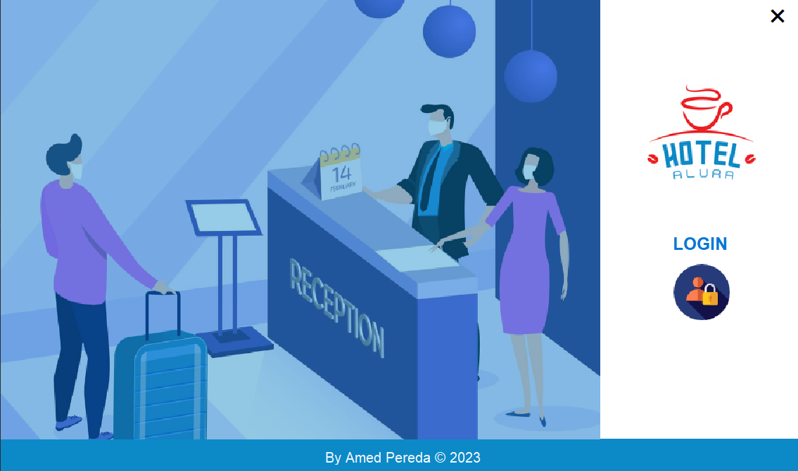

# Challenge ONE | Java | Back-end | Hotel Alura

     

---

## 🔍 ¡En el repositorio!

### Este es el repositorio del proyecto hotel alura, en el encontrarás:
#### 🔹 src/db: carpeta con el archivo sql para la conexion a la base de datos para el funcionamineto de la aplicación;
 

## 🚧 Proyecto

#### Al clonar o descargar el proyecto tendrás esta presentación al ejecutar el proyecto en Eclipse:

     

